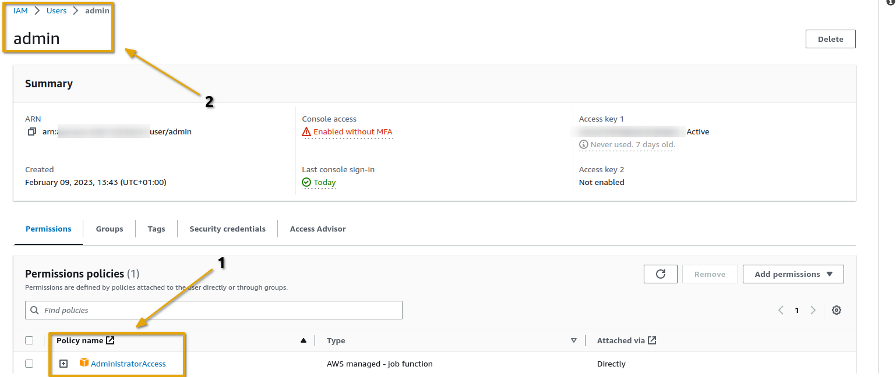
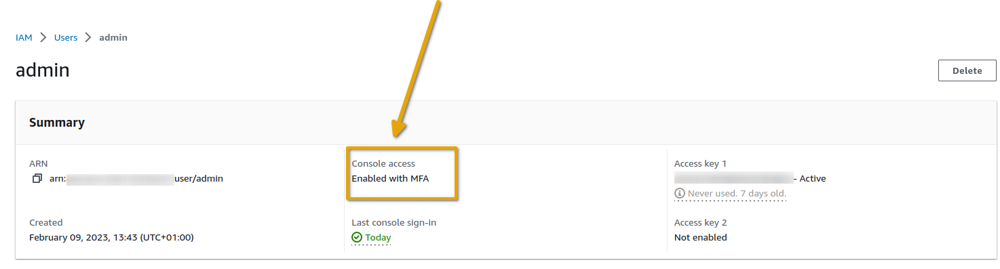
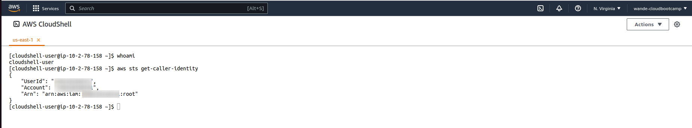

# Week 0 — Billing and Architecture


## Synopsis:
Week 0 introduced and made me understand the business case and needs of the cruddur application. The cost, security measures etc, estimates of the environment its to be built in and the logical/conceptual setup of app. My **Tasks** were some specific instructions listed in [Required Homework](#required) and an unrestricted [Homework Challenges](#challenges) to explore further. I first identified the resources  needed to complete these tasks, mapped a study plan with clear objectives and timelines, and fostered relationships with people who seemed more evidently techinical on the official discord server. As a result of all these, I was able to finish up and dive deeper into all what is needed to successfully and excellently complete this project. Watch  this space....
 
## [Required Homework](#required):
1. **IAM Admin User**: Created an IAM admin user with admin access policy and generated AWS credentials from it.

2. **MFA**: Enabled Multi Factor Authentication for the admin user's console access

3. **Cloud Shell**: I launched my cloud shell on the AWS console and ran some commands on it

4. **AWS CLI**: Using Gitpod, I synced the cruddur repository on Github with a web VScode then installed, and configured AWS CLI. 
- I added the gitpod task below to my `.gitpod.yml` file to use partial autoprompt mode in debugging.

- The Installation commands for linux OS:
	```shell
	curl "https://awscli.amazonaws.com/awscli-exe-linux-x86_64.zip" -o "awscliv2.zip"
	unzip awscliv2.zip
	sudo ./aws/install
	```
- The Configuration commands:
	```shell
	gp env AWS_ACCESS_KEY_ID="xxxxxxxxx"
	gp env AWS_SECRET_ACCESS_KEY="xxxxxxx"
	gp env AWS_DEFAULT_REGION=us-east-1
	```
- Verify Configuration by running `aws sts get-caller-identity`. It should look like this

5. **Billing Alarm**: Upon authorizing *Billing Alerts* in Root Account, I was set to create a billing Alarm via the AWS CLI.
- Created a Simple Notification Service(SNS) Topic and setup a subscription to serve it

- Email Confirmation

- Created the metric-alarm by linking the topic previously created in configurations of a new file named `alarm-config.json` present in the aws folder generated when installed.
- The Configuration syntax:
```json
{
    "AlarmName": "DailyEstimatedCharges",
    "AlarmDescription": "This alarm would be triggered if the daily estimated charges exceeds 10$",
    "ActionsEnabled": true,
    "AlarmActions": [
        "arn:aws:sns:us-east-1:548xxxxxxxxx:billing-alarm"
    ],
    "EvaluationPeriods": 1,
    "DatapointsToAlarm": 1,
    "Threshold": 10,
    "ComparisonOperator": "GreaterThanOrEqualToThreshold",
    "TreatMissingData": "breaching",
    "Metrics": [{
        "Id": "m1",
        "MetricStat": {
            "Metric": {
                "Namespace": "AWS/Billing",
                "MetricName": "EstimatedCharges",
                "Dimensions": [{
                    "Name": "Currency",
                    "Value": "USD"
                }]
            },
            "Period": 86400,
            "Stat": "Maximum"
        },
        "ReturnData": false
    },
    {
        "Id": "e1",
        "Expression": "IF(RATE(m1)>0,RATE(m1)*86400,0)",
        "Label": "DailyEstimatedCharges",
        "ReturnData": true
    }]
}
```

6 **Budget**: I created this also in the AWS CLI using Gitpod
- Firstly fill in configuration into a new file named `budjet.json` present in the aws folder generated when installed.
- Configurstion Syntax:
```json
{
    "BudgetLimit": {
        "Amount": "10",
        "Unit": "USD"
    },
    "BudgetName": "Go Away Sapa",
    "BudgetType": "COST",
    "CostFilters": {
        "TagKeyValue": [
            "user:Key$value1",
            "user:Key$value2"
        ]
    },
    "CostTypes": {
        "IncludeCredit": true,
        "IncludeDiscount": true,
        "IncludeOtherSubscription": true,
        "IncludeRecurring": true,
        "IncludeRefund": true,
        "IncludeSubscription": true,
        "IncludeSupport": true,
        "IncludeTax": true,
        "IncludeUpfront": true,
        "UseBlended": false
    },
    "TimePeriod": {
        "Start": 1477958399,
        "End": 3706473600
    },
    "TimeUnit": "MONTHLY"
}
```
- created a new file in same directoy called `notifications-with-subscribers.
-Configuration syntax
```json
[
    {
        "Notification": {
            "ComparisonOperator": "GREATER_THAN",
            "NotificationType": "ACTUAL",
            "Threshold": 60,
            "ThresholdType": "PERCENTAGE"
        },
        "Subscribers": [
            {
                "Address": "xxxxxxxxgmail.com",
                "SubscriptionType": "EMAIL"
            }
        ]
    }
]
```
- Slot in credentials and run
```shell
aws budgets create-budget \
    --account-id AccountID \
    --budget file://aws/budget.json \
    --notifications-with-subscribers file://aws/budget-notifications-with-subscribers.json
``` 

7. **Conceptual/Napkin Diagram**: View the lucid chart link [here](https://lucid.app/lucidchart/da34a832-f420-41d2-b821-dd99199001f5/edit?viewport_loc=-540%2C-150%2C3180%2C1620%2C0_0&invitationId=inv_7b6ebe3b-c751-47cf-8046-03f49f44ffe5).

Diagram Flow:
	* The WEB Layer entails when cruddur app users gain access through the internet and make requests. The requests are autheticated via a decentralized system then passed to the load balancer which routes it to either the front end or the back end in the APP layer depending of the kind of requests.
	* The APP layer comprises of the Front end(serves the website) and Back end(entails the server that works with generated data from users) and they both communicate via APIs.
	* Users can search for data with search service and this is attached to the backend server
	* Caching aids real time experience for the users.
	* The DATABASE layer contains stateful data for storing the Epheremal *cruds* and user identities.		* The messaging system gets data from the database and curates the feed to users prefrences.
	* Security involves securing the entire app, by using secure coding practices, performing regular security audits, and using intrusion detection and prevention systems.
	* At the end of the day, we get a fully functional and highly lucrative application that gives huge Return on Investment(ROI).

## [Homework Challenges](#challenges)


## References:
* [Basic Writing and Formating Syntax](https://docs.github.com/en/get-started/writing-on-github/getting-started-with-writing-and-formatting-on-github/basic-writing-and-formatting-syntax)
* [Securing an AWS Account](https://learn.cantrill.io/courses)
*
