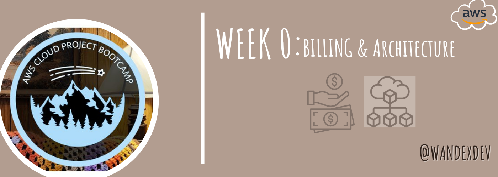
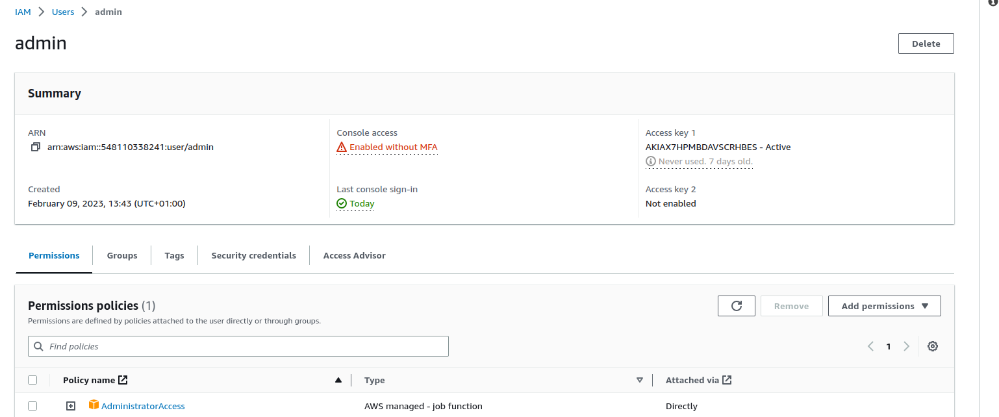

# Week 0 — Billing and Architecture

## Synopsis:
Week 0 introduced and made me understand the business case and needs of the cruddur application. The cost, security measures etc estimate of the environment its to be built in and the logical/conceptual setup of app. My **Tasks** were some specific instructions listed in [Required Homework](#required) and an unrestricted [Homework Challenges](challenges) to explore further. I first identified the resources  needed to complete these tasks, mapped a study plan with clear objectives and timelines, and tried foster relationships with evidently more techinically skilled people on the discord channel. As a result of all these, I was able to finish up and dive deeper into all what is needed to successfully and excellently complete this project. Watch out for this space for more!
 
## [Required Homework](#required):
1. Admin User: Created an IAM admin user with admin acess policy

2. MFA 

## References:
* [Basic Writing and Formating Syntax](https://docs.github.com/en/get-started/writing-on-github/getting-started-with-writing-and-formatting-on-github/basic-writing-and-formatting-syntax)
* 
