# Week 0 — Billing and Architecture
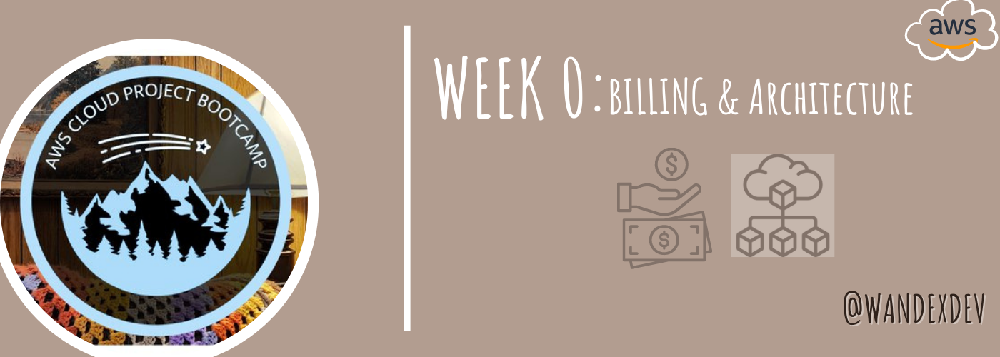

## Synopsis:
Week 0 introduced and gave me in-depth knowledge of the business use case and needs of the cruddur application. The cost, security measures etc, estimates of the yet-to-be-built environment and the logical/conceptual setup of the app. My **Tasks** were some specific instructions listed in [Required Homework](#required) and an unrestricted [Homework Challenges](#homework-challenges) which enabled me explore further. I first identified the resources needed to complete these tasks, mapped a study plan with clear objectives and timelines, and fostered relationships with people who seemed more evidently technical on the official discord server. As a result of all these, I was able to finish up and dive deeper into all that is needed to efficiently complete this project. 
 
## [Required Homework](#required)
> Account ID: 548XXXXXXXXX
>
> Root Account Alias: wande-cloudbootcamp
>
> IAM admin user Alias: admin @ wande-cloudbootcamp

### 1. IAM Admin User:
Created an IAM admin user with admin access policy and generated AWS credentials from it.
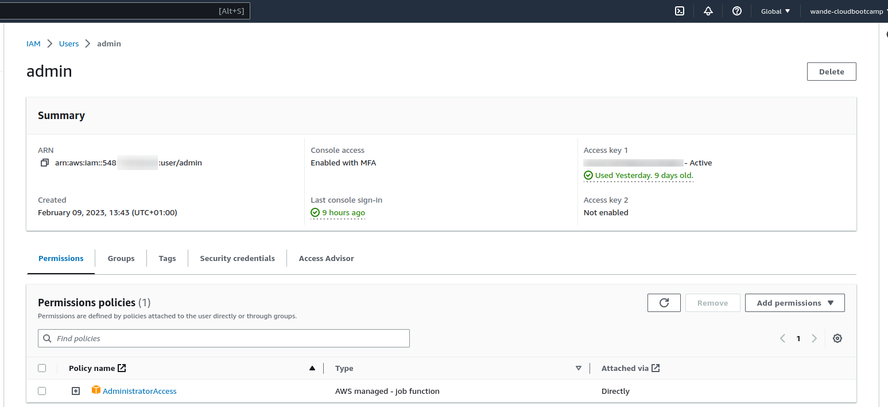
### 2. MFA: 
Enabled Multi Factor Authentication for the root and admin user's console access. I used Google authenticator app on my mobile phone to achieve this.
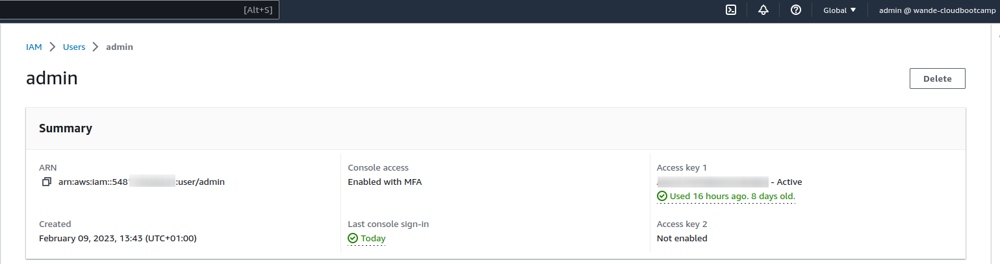
### 3. Cloud Shell: 
I launched my cloud shell on the AWS console and ran some commands on it
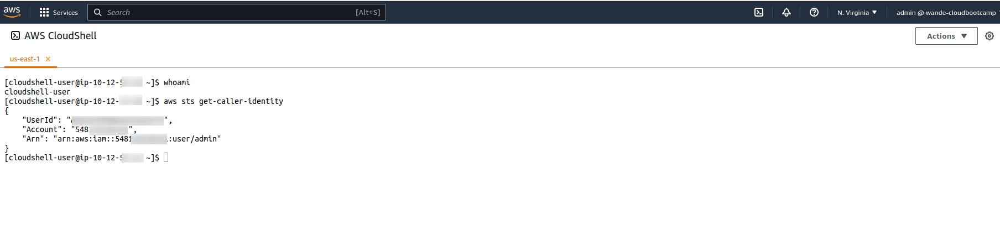
### 4. AWS CLI: 
Using Gitpod, I synced the cruddur repository on Github with a web VScode then installed, and configured AWS CLI. 
- I added the gitpod task below to my `.gitpod.yml` file to use partial autoprompt mode in debugging.
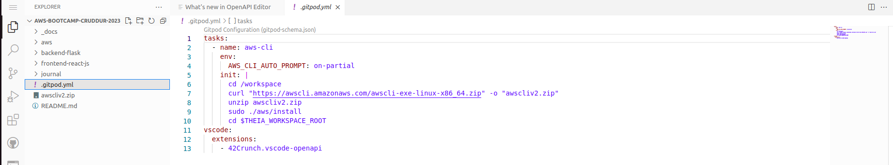
- The Installation commands for linux OS:
	```shell
	curl "https://awscli.amazonaws.com/awscli-exe-linux-x86_64.zip" -o "awscliv2.zip"
	unzip awscliv2.zip
	sudo ./aws/install
	```
- The Configuration commands:
	```shell
	gp env AWS_ACCESS_KEY_ID="xxxxxxxxx"
	gp env AWS_SECRET_ACCESS_KEY="xxxxxxx"
	gp env AWS_DEFAULT_REGION=us-east-1
	```
- Verify Configuration by running `aws sts get-caller-identity`. It should look like this:
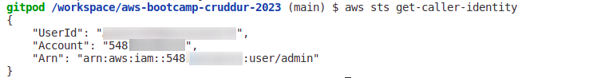
### 5. Billing Alarm:
Upon authorizing Billing Alerts in Root Account, I was set to create a billing Alarm via the AWS CLI.
* I created a Simple Notification Service(SNS) Topic and setup a subscription to serve it
* Here's the command ran on gitpod workspace below:
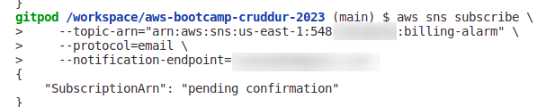
* Here is the Email Confirmation above:
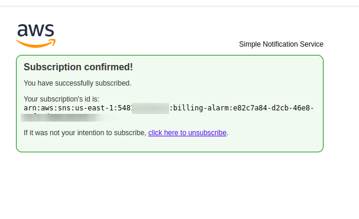
* I then created the metric-alarm to be trigerred if cost surpasses $1 by linking the topic previously created in configurations of a new file named `alarm-config.json` present in the aws folder generated when installed.
* Find the Configuration syntax below:

<details><summary>CLICK ME</summary>

```json
{
    "AlarmName": "DailyEstimatedCharges",
    "AlarmDescription": "This alarm would be triggered if the daily estimated charges exceeds 10$",
    "ActionsEnabled": true,
    "AlarmActions": [
        "arn:aws:sns:us-east-1:548xxxxxxxxx:billing-alarm"
    ],
    "EvaluationPeriods": 1,
    "DatapointsToAlarm": 1,
    "Threshold": 10,
    "ComparisonOperator": "GreaterThanOrEqualToThreshold",
    "TreatMissingData": "breaching",
    "Metrics": [{
        "Id": "m1",
        "MetricStat": {
            "Metric": {
                "Namespace": "AWS/Billing",
                "MetricName": "EstimatedCharges",
                "Dimensions": [{
                    "Name": "Currency",
                    "Value": "USD"
                }]
            },
            "Period": 86400,
            "Stat": "Maximum"
        },
        "ReturnData": false
    },
    {
        "Id": "e1",
        "Expression": "IF(RATE(m1)>0,RATE(m1)*86400,0)",
        "Label": "DailyEstimatedCharges",
        "ReturnData": true
    }]
}
```
</details>

* Here's the end result on the console:
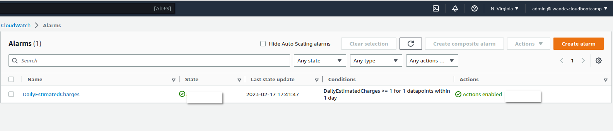
### 6. Budget: 
I created a monthly **$10 spend budget** also in the AWS CLI using Gitpod while I already had a **zero-spend budget** to watch if I had left the free tier limits.
- Firstly fill in configuration into a new file named `budjet.json` present in the aws folder generated when installed.
- Find the Configuration Syntax below:

<details><summary>CLICK ME</summary>

```json
{
    "BudgetLimit": {
        "Amount": "10",
        "Unit": "USD"
    },
    "BudgetName": "Go Away Sapa",
    "BudgetType": "COST",
    "CostFilters": {
        "TagKeyValue": [
            "user:Key$value1",
            "user:Key$value2"
        ]
    },
    "CostTypes": {
        "IncludeCredit": true,
        "IncludeDiscount": true,
        "IncludeOtherSubscription": true,
        "IncludeRecurring": true,
        "IncludeRefund": true,
        "IncludeSubscription": true,
        "IncludeSupport": true,
        "IncludeTax": true,
        "IncludeUpfront": true,
        "UseBlended": false
    },
    "TimePeriod": {
        "Start": 1477958399,
        "End": 3706473600
    },
    "TimeUnit": "MONTHLY"
}
```
</details>

- Created a new file in same directoy called `notifications-with-subscribers.
- Find the Configuration syntax below:

<details><summary>CLICK ME</summary>

```json
[
    {
        "Notification": {
            "ComparisonOperator": "GREATER_THAN",
            "NotificationType": "ACTUAL",
            "Threshold": 60,
            "ThresholdType": "PERCENTAGE"
        },
        "Subscribers": [
            {
                "Address": "xxxxxxxxgmail.com",
                "SubscriptionType": "EMAIL"
            }
        ]
    }
]
```

</details>

- Slot in your credentials and run:
```shell
	aws budgets create-budget \
    	--account-id AccountID \
    	--budget file://aws/budget.json \
    	--notifications-with-subscribers file://aws/budget-notifications-with-subscribers.json
``` 
- Here's the final output of the budjet on the console:
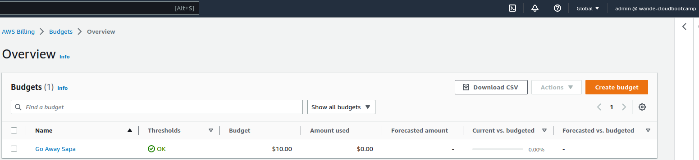
- Previous and new budjets on the console:
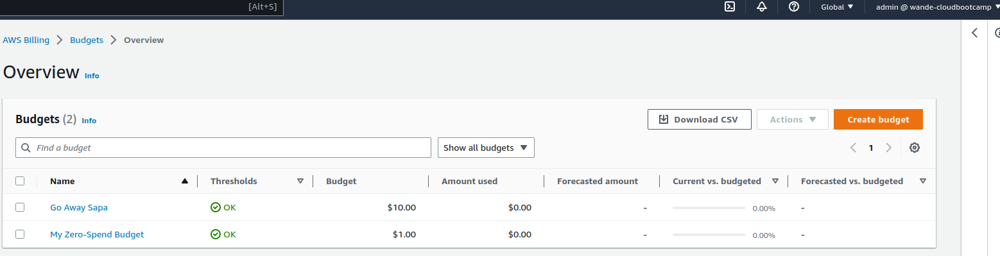
### 7. Conceptual/Napkin Diagram: 
View the lucid chart of this 'no technical jagon' [here](https://lucid.app/lucidchart/da34a832-f420-41d2-b821-dd99199001f5/edit?viewport_loc=-540%2C-150%2C3180%2C1620%2C0_0&invitationId=inv_7b6ebe3b-c751-47cf-8046-03f49f44ffe5).
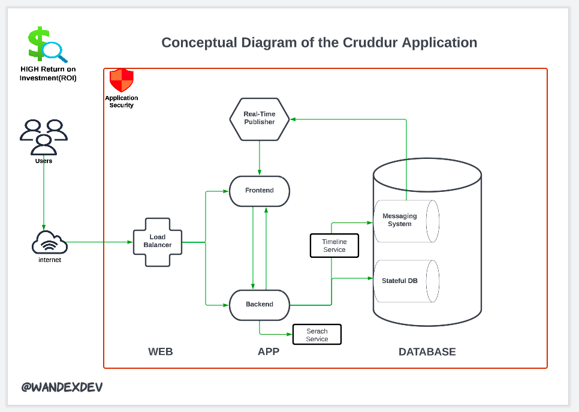
Diagram Flow:
- The WEB Layer entails when cruddur app users gain access through the internet and make requests. The requests are autheticated via a decentralized system then passed to the load balancer which routes it to either the front end or the back end in the APP layer depending of the kind of requests.
- The APP layer comprises of the Front end(serves the website) and Back end(entails the server that works with generated data from users) and they both communicate via APIs.
- Users can search for data with search service and this is attached to the backend server
- Caching aids real time experience for the users.
- The DATABASE layer contains stateful data for storing the Epheremal *cruds* and user identities.
- The messaging system gets data from the database and curates the feed to users prefrences.
- Security involves securing the entire app, by using secure coding practices, performing regular security audits, and using intrusion detection and prevention systems.
- At the end of the day, we get a fully functional and highly lucrative application that gives huge Return on Investment(ROI).
### 8. Logical/Architecture Diagram:
View the lucid chart of this highly technical type [here](https://lucid.app/lucidchart/6855340c-c655-4009-ae53-7a8ad1480d26/edit?viewport_loc=-526%2C8%2C3184%2C1660%2C0_0&invitationId=inv_c791bc55-d016-4ae5-810c-3432121e2c59).
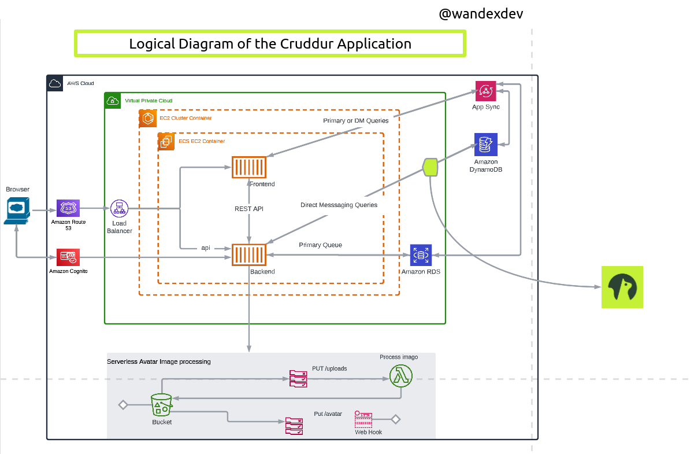
- The Logical Diagram otherwise called Architecture Diagram is a more detailed type of diagram that shows the distributed system componets and it communicates the work flow to the engineers involved in building it.

## [Homework Challenges](#challenges)
Here is a little summary before the details:
- [x] Destroyed all root user credentials.
- [x] Created a Lambda JavaScript function to use event bridge to link health dashboard and sns topic.
- [x] Quiz on six pillars of the well-architected framework and their specific use cases
- [x] Reviewed the questions of each well Architected Tool
- [x] Created a CI/CD pipeline for the cruddur app 
- [x] Intentionally attended a few virtual events this week in order to get AWS credits and explore more services on my account
- [x] Attended 2 workshops organized by AWS to properly understand some AWS services use cases.
- [x] Researched on the confinements of the free tier service limits and its impact on the flexibility of technical architectures especially the one planned for the cruddur application.

### 1. Destroyed all root user credentials:
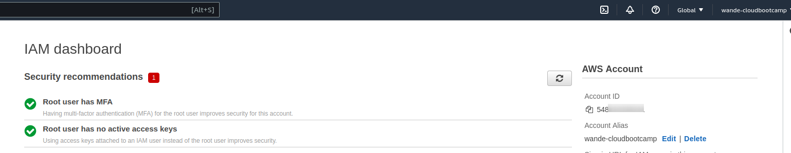

### 2. Event Brigde:
Event Bridge basically sits in between decoupled services and it allows routing of messages between the services. A rule is created and eventBridge knows where to route the messge when the message arrives.
- I firstly researched on the spend for SNS topics and email deliveries(check out the No. 8 section of the [Homework Challenges](#homework-challenges) for that.
- I created an sns topic and email subscription
- I created a Lambda Javascript function
- Used an Eventbridge rule to trigger the Lambda function 

### 3. Quiz on well-architected framework by TutorialDojo

- Took numerous quizzes to test my knowledge of the well-architected framework and their specific use cases.

### 4. Reviewed well Architected Tool


### 8. Research on Free Tier Service Limits:
- Starting with **Amazon SNS** as it happens that they would be used a lot. I discovered that Amazon SNS is included in Free Tier, Each month, I would incur no charges for the first 1 million Amazon SNS requests, no charges for the first 100,000 notifications over HTTP, and no charges for the first 1,000 notifications over email. 
- 


## References:
* [Basic Writing and Formating Syntax](https://docs.github.com/en/get-started/writing-on-github/getting-started-with-writing-and-formatting-on-github/basic-writing-and-formatting-syntax)
* [Securing an AWS Account](https://learn.cantrill.io/courses)
* [Organizing Information with Collapsed sections](https://docs.github.com/en/get-started/writing-on-github/working-with-advanced-formatting/organizing-information-with-collapsed-sections)
