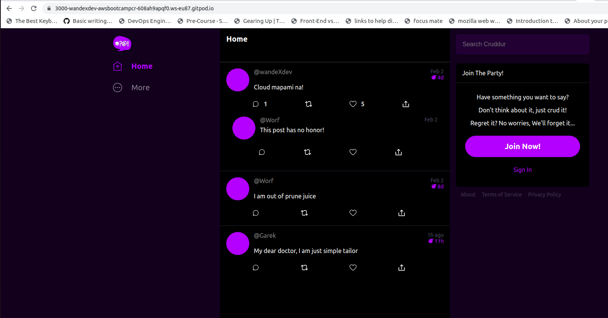

# Week 1 — App Containerization


## Synopsis:
Week 1 deep dived into functional use cases of docker. I started learning about Docker a week prior to the bootcamp starting and this week maximized the knowledge gained so far. I got to build and run containers for the front and back end of the cruddur application, play around with the app's codebase, implement best practices in creating their images, implement health checks on both builds, push my custom image to docker hub and re-pull for use etc. The [Homework Challenges](#homework-challenges) streched me soo much this week!!! and Im glad it did. I ended up deploying one of the images on a Google Kubernetes Engine(GKE)

## [Required Homework](#required)
### 1. Containerize Application:
> **PS**
>
> This is the Gitpod workspaces version

Succeeded in containerizing the front and back end cruddur app codebases and testing them with gitpod's url to affirm the success.
#### THE BACKEND:
- Started by writing a docker file for **backend end(Python-flask)**, defined the paths and commands needed to build the image for the container. Find the well documented docker file  [here](https://github.com/wandexdev/aws-bootcamp-cruddur-2023/blob/main/backend-flask/Dockerfile)

- Prepared the python environment in my working directory by installing dependencies, setting environment variables for CORS, running the below command and unlocking the gitpod port:
    ```shell
        pip3 install -r requirements.txt
    ```
    ```shell
        export BACKEND_URL="*"
        export FRONTEND_URL="*"
    ```
    ```shell
        python3 -m flask run --host=0.0.0.0 --port=4567
    ```
> ```-m``` mean module
>
> ```--host=0.0.0.0``` binds host to entire ipv4 for easy access
>
> ```--port=4567``` is the port allocated for it to run
- Test-Run the gitpod url with ```/api/activities/home```

- Finally built the image with ```docker build -t flask-backend ./flask-backend``` from the repository root directory
- A running image is a **container** so I ran ```docker container run --rm -p 4567:4567 -d backend-flask``` to run the image.
>
> ```--rm``` kills and remove the container once stopped to prevent pile up
>
> ```-p 4567:4567``` specifies port of Host OS binded to port of container
> 
> ```-d``` mean to run process in detached mode not current terminal

<!--- place holder for ensuring environmet variables are saved-->
#### THE FRONTEND:
- Started the **Frontend (REACT-JS) with writing a docker file also, in the frontend directory. Find it [here](https://github.com/wandexdev/aws-bootcamp-cruddur-2023/blob/main/frontend-react-js/Dockerfile)
- Ran ```npm i``` in the root directory to prepare the envirnment. NPM is a node package manager, it helps to manage the node packages for the application to properly run.
- Built the image with ```docker build -t frontend-react-js```
> ```-t``` option is specifying the image name and when paired with ```:<anything>```, 
>
> it gives name + tag e.g ```mysql:latest```
- Ran the image and turn into a container with ```docker run -p 3000:3000 -d frontend-react-js```

#### ALL CONTAINERS WITH DOCKER COMPOSE:
- Docker Compmose allows multiple containers defined in its .yml file to run them simultenously, created the yaml file [here](https://github.com/wandexdev/aws-bootcamp-cruddur-2023/blob/main/docker-compose.yml) in the root directory.
- Mounted volumes to the Host OS's directory by binding XXXXXX and this enables me make live changes to the application code in my directory while the changes syncs with the one in the container

- Ran ```docker compose up``` and it ran the containers. 
### 2. Notification Endpoint for the OpenAI Document:
- Open API (formerly called SWAGGER) is a standard for defining general API's. It esaily augments services like API Gateway, api documentaion etc
- The Endpoint documentation can be uploaded to [readme.com](https://readme.com/) where the API documentation would be transformed to interactive hubs that help developers.
- I added an endpoint for notification in [this](https://github.com/wandexdev/aws-bootcamp-cruddur-2023/blob/main/backend-flask/openapi-3.0.yml) file. Here is the file and **OpenAPI SwaggerUI** preveiw:


### 3. Flask Backend Endpoint for Notifications:
- The home section has similar schema and features with the intended notification section so the values were duplicated and refactored.
- I created the ```notifications_activites.py``` file from ```home_activities.py``` file.
- Sourced the ```notifications_activites.py``` file in the ```app.py``` file.
- Redirected the url from ```app.py``` to ```notifications_activites.py```
- Troubleshooted an error that lead to no json output when testing the Endpoint URL at ```.../api/activities/notifications```
- Final perfect output:

### 4. React Page for Notifications:
- React js is the language used to write the frontend application code of the cruddur application.
- I created  ```NotificationsFeedPage.js``` and ```NotificationsFeedPage.css``` files.
- Sourced the ```NotificationsFeedPage.js``` file in the ```app.py``` file.
- ```DesktopNavigation.js``` already sorted
-Here's the final perfect output:

### 5. DynamoDB Local Container:
### 6. Postgres Container:
### 7.

## [Homework Challenges](#challenges)
Here is a little summary before the details:
- [x] Ran the dockerfile CMD as an external Shell (.sh) script.
- [x] Pushed and tagged an image to DockerHub.
- [x] Used multi-stage building for a Dockerfile build
- [x] Implemented a healthcheck in the Version 3 Docker compose file
- [x] Installed Docker on localmachine and got the same containers running outside my Gitpod.
- [x] Launched an EC2 instance that has docker installed, and pulled an image to demonstrate my knowledge of docker processes. 

### 1. DockerFile CMD ran as an external SHELL Script
- I created two shell scripts. Each for the docker files in both frontend and backend directories.
- For **backend**, I created the ```flash.sh``` file with the entry points commands updated to it. I added the permissions for the file to run also in the docker file
    ```shell
        #!/bin/bash
        python3 -m flask run --host=0.0.0.0 --port=4567
    ```
 - Replace 

    ```Dockerfile
    CMD [ "python3", "-m" , "flask", "run", "--host=0.0.0.0", "--port=4567"]
    ``` 

    with:

```Dockerfile
        # Copy the shell script to the container
        COPY flask.sh flask.sh

        # Give Permissions to the script
        RUN chmod +x flask.sh

        # Execute external script instead of CMD commands
        CMD [ "/bin/bash", "flask.sh" ] 
```
- For the **frontend**, I created the ```npm.sh``` file with the entry points commands updated to it. I added the permissions for the file to run also in the docker file
    ```shell
        #!/bin/sh
        npm start
    ```
 - Replace 

```Dockerfile
    CMD ["npm", "start"]
```
    with:
```Dockerfile
        # Copy the shell script to the container
        COPY flask.sh npm.sh

        # Give Permissions to the script
        RUN chmod +x npm.sh

        # Execute external script instead of CMD commands
        CMD [ "/bin/bash", "npm.sh" ] 
```

- Build and run container with ```docker-compose up -d``` 
### 2. Pushed and tagged an image to DockerHub
### 3. Used multi-stage building for a Dockerfile build
### 4. Implemented a healthcheck in the Version 3 Docker compose file
### 5. Installed Docker on localmachine and got the same containers running outside my Gitpod
### 6. Launched an EC2 instance that has docker installed, and pulled an image to demonstrate my knowledge of docker processes. 


## Refrences:
- [Github Syntax Highlighting](https://github.com/github/linguist/blob/master/lib/linguist/languages.yml)
- [How To Run Custom Script Inside Docker](https://devopscube.com/run-scripts-docker-arguments/)