# Week 2 — Distributed Tracing
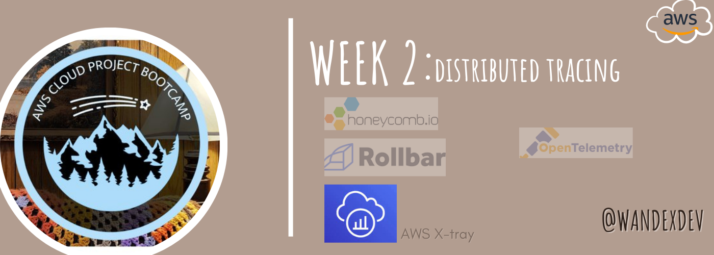

## Synopsis:
Week 2 emphasized **observability** and I learnt about its 4 pillars (metrics, logs, events and traces) as well as how crucial it is in the entire software development cycle. 

## [Required Homework](#required)
### 1. Instrument backend flask app to Open Telemetry (OTEL) using Honeycomb.io
- opened honeycomb.io
- created an honey comb account then created a new envirnment called bootcamp
- clicked API keys to get the API_HONEYCOMB_KEY
- exported as an environment variable and to saved it to gitpod's envirnment when restarted.
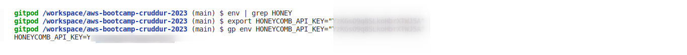
- The Service name determines the spans that get sent from the application.
- It is preferable not to set them in the work environment to prevent consistency. We want them set seperately so they're specific to the services. e.g like hardcoding it in docker compose file.
- Copied the OTEL_SERVICE_NAME and hard coded it into the backend section of the docker compose
- Confirguring **OTEL(Open Telemetry)** to send to honeycomb:
> **Open telemetry is part of the vendor- neutral Cloud Native Computing Foundation(CNCF)**;
>
> **its a standardized method for all observabilty tools e.g HoneyComb, AWS xray etc**
```
OTEL_EXPORTER_OTLP_ENDPOINT: "https://api.honeycomb.io"
OTEL_EXPORTER_OTLP_HEADERS: "x-honeycomb-team=${HONEYCOMB_API_KEY}"
```
- cd backend folder
- put in the installation command from honeycomb docs to instrument a Flask app with OpenTelemetry in the requirements.txt file:
- requests are the python http client so when we make outgoing http calls, it instruments it
```
opentelemetry-api
opentelemetry-sdk
opentelemetry-exporter-otlp-proto-http
opentelemetry-instrumentation-flask
opentelemetry-instrumentation-requests
```
- run:
```pip install -r requirements.txt```
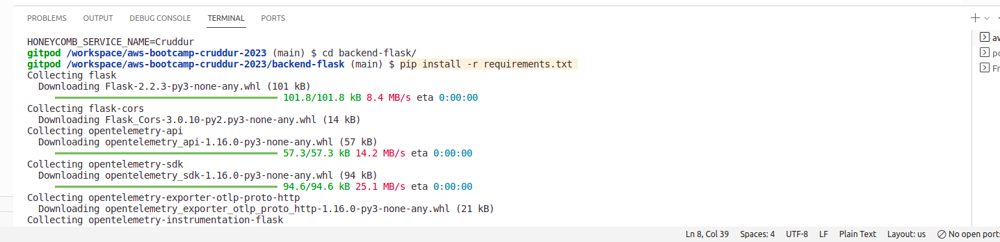
- Next step is adding the initializion lines to the flaskapp.py file and make comments to distinguish. These updates will create and initialize a tracer and Flask instrumentation to send data to Honeycomb:
```python
from opentelemetry import trace
from opentelemetry.instrumentation.flask import FlaskInstrumentor
from opentelemetry.instrumentation.requests import RequestsInstrumentor
from opentelemetry.exporter.otlp.proto.http.trace_exporter import OTLPSpanExporter
from opentelemetry.sdk.trace import TracerProvider
from opentelemetry.sdk.trace.export import BatchSpanProcessor
```
- Next
```python
# HoneyComb -----------
# Initialize tracing and an exporter that can send data to Honeycomb
provider = TracerProvider()
processor = BatchSpanProcessor(OTLPSpanExporter())
provider.add_span_processor(processor)
trace.set_tracer_provider(provider)
tracer = trace.get_tracer(__name__)
```
- Next
```python
# Initialize automatic instrumentation with Flask
app = Flask(__name__)
FlaskInstrumentor().instrument_app(app)
RequestsInstrumentor().instrument()
```
### 2. Run Queries to explore traces within Honeycomb.io
- Testing the setup
    - Already had my frontend initialised thanks to the gitpod configuration
    - cd to root folder
    - Docker Compose up
    - All set and receiving data
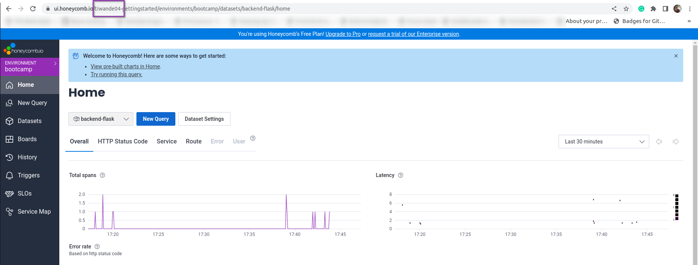
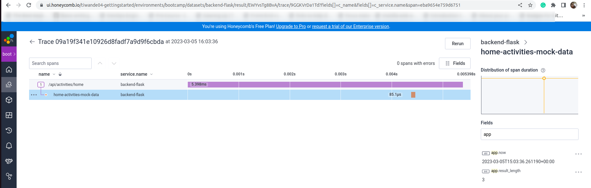
- To debug or test if you're unsure where the api key is coming from, try [honeycomb-whoami.glitch.me](honeycomb-whoami.glitch.me)
-Hardcode spans: The code is to create spans for the backend flask
- go to honey comb docs for open telemetry and python
```python
from opentelemetry import trace

tracer = trace.get_tracer(__name__)
with tracer.start_as_current_span("http-handler"):
    with tracer.start_as_current_span("my-cool-function"):
        # do something
```
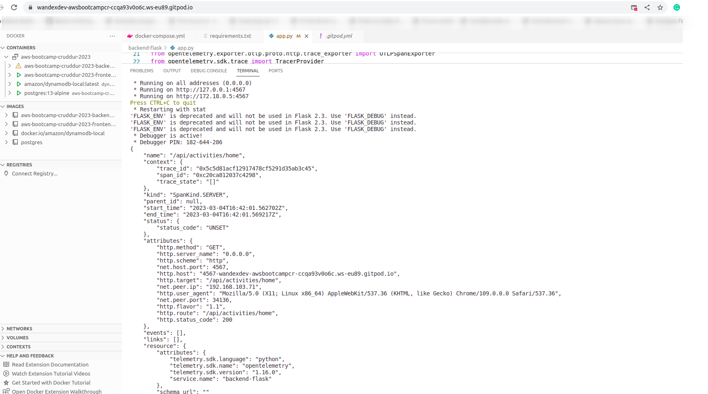
- Adding attributes to the span we created
```python
span = trace.get_current_span()
span.set_attribute("user.id", user.id())
```
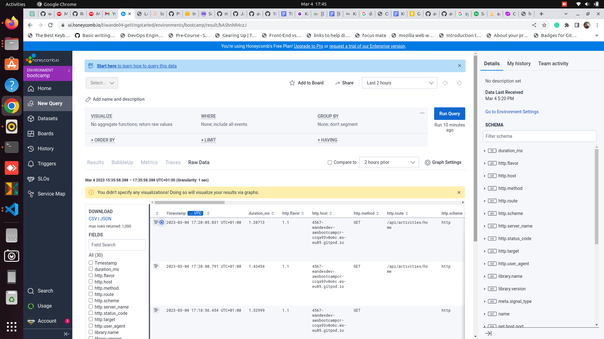
### 3. Instrument AWS X-Ray into backend flask app
- X-ray is an AWS Observabilty service
- an **x-ray deamon** collects and batches to the **x-ray api** inorder to visualize your data 
- copy ```aws-xray-sdk``` and paste in ```requirements.txt``` in the backend folder
- run pip install -r requirements.txt
- Add the below xray configuration codes to the ```app.py``` file
```python
from aws_xray_sdk.core import xray_recorder
from aws_xray_sdk.ext.flask.middleware import XRayMiddleware

xray_url = os.getenv("AWS_XRAY_URL")
xray_recorder.configure(service='backend-flask', dynamic_naming=xray_url)

XRayMiddleware(app, xray_recorder)
```

- touch ```aws/json/xray.json``` to create a new file in the aws directory and paste:
```json
{
    "SamplingRule": {
        "RuleName": "Cruddur",
        "ResourceARN": "*",
        "Priority": 9000,
        "FixedRate": 0.1,
        "ReservoirSize": 5,
        "ServiceName": "backend-flask",
        "ServiceType": "*",
        "Host": "*",
        "HTTPMethod": "*",
        "URLPath": "*",
        "Version": 1
    }
  }
```
- Create Log group:
```shell
aws xray create-group \
   --group-name "Cruddur" \
   --filter-expression "service(\"backend-flask\")"
```
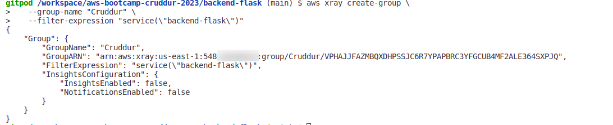
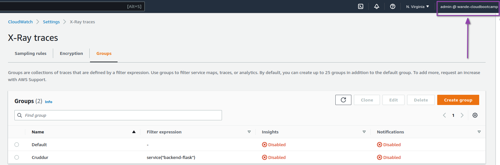
- Create sampling rule
- cd root folder and paste: ```aws xray create-sampling-rule --cli-input-json file://aws/json/xray.json```
[json sampling rule](assets/wk2/jsonsamplingrule.png)
[console sampling rule](/assets/wk2/consolesamplingrule.png)
### 4. Configure, provision X-Ray daemon within docker-compose 
- Copy and paste these contents to the `docker-compose.yml``` file
```YAML
xray-daemon:
    image: "amazon/aws-xray-daemon"
    environment:
      AWS_ACCESS_KEY_ID: "${AWS_ACCESS_KEY_ID}"
      AWS_SECRET_ACCESS_KEY: "${AWS_SECRET_ACCESS_KEY}"
      AWS_REGION: "us-east-1"
    command:
      - "xray -o -b xray-daemon:2000"
    ports:
      - 2000:2000/udp
```
- Details:
    - The ```amazon/aws-xray-daemon``` is an image found in a public Elastic Container Registry(ECR)repository on docker hub and its managed by amazon.
    - The AWS credentials variables to be parsed have been stored on gitpod prevously,
    - Added the additional x-ray variables and url to the docker compose file
    AWS_XRAY_URL: "*4567-${GITPOD_WORKSPACE_ID}.${GITPOD_WORKSPACE_CLUSTER_HOST}*"
    AWS_XRAY_DAEMON_ADDRESS: "xray-daemon:2000"
### 5. Observe X-Ray in AWS console
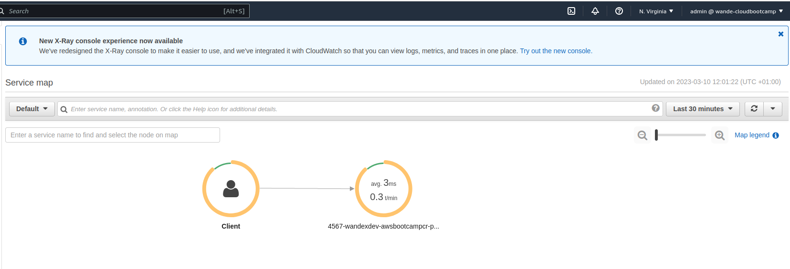
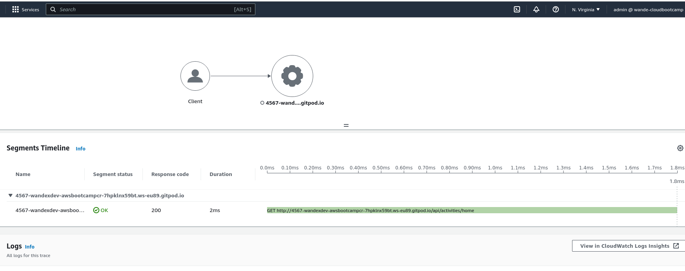
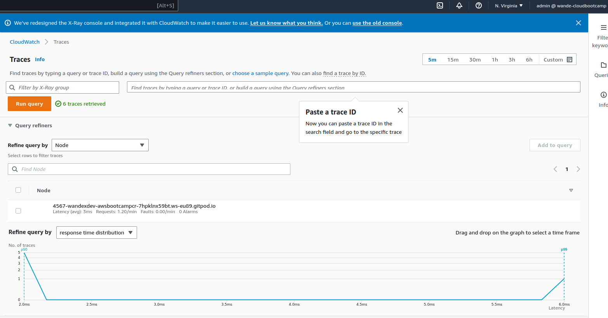
### 6. Integrate Rollbar and capture error
-

### 7. Configure custom logger to send CloudWatch Logs
- Install watch tower by placing watchtower in the ```requiremnets.txt``` file
- paste in ```app.py``` file to set up Cloudwatch log called cruddur and set up handler for logging in information.
```python
# Cloudwatch Logs -----
import watchtower
import logging
from time import strftime
```
```python
# Configuring Logger to Use CloudWatch
LOGGER = logging.getLogger(__name__)
LOGGER.setLevel(logging.DEBUG)
console_handler = logging.StreamHandler()
cw_handler = watchtower.CloudWatchLogHandler(log_group='cruddur')
LOGGER.addHandler(console_handler)
LOGGER.addHandler(cw_handler)
LOGGER.info("some message")
```
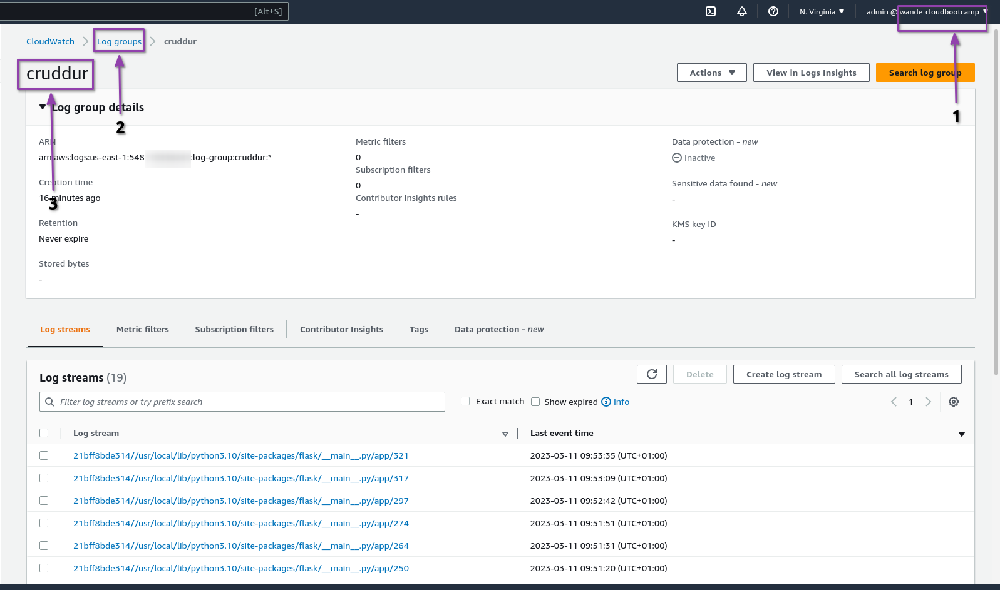
- Add below code also to log in errors after every singke requests:
```python
@app.after_request
def after_request(response):
    timestamp = strftime('[%Y-%b-%d %H:%M]')
    LOGGER.error('%s %s %s %s %s %s', timestamp, request.remote_addr, request.method, request.scheme, request.full_path, response.status)
    return response
```
- Set the env variables of backend flask in the ```docker-compose.yml``` file
```shell
      AWS_DEFAULT_REGION: "${AWS_DEFAULT_REGION}"
      AWS_ACCESS_KEY_ID: "${AWS_ACCESS_KEY_ID}"
      AWS_SECRET_ACCESS_KEY: "${AWS_SECRET_ACCESS_KEY}"
```
- add custom logging:
```python
# In the home_activities.py  file
  def run(logger):
    logger.info("HomeActivities")

# In the app.py file
@app.route("/api/activities/home", methods=['GET'])
def data_home():
  data = HomeActivities.run(logger=LOGGER)
  return data, 200
```
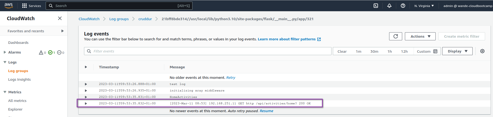
- Commented out all the logs changes in the code to prevent excess cost incurement
- Turned off codes for AWS xray also

## [Homework Challenges](#challenges)
Here is a little summary before the details:
- [x] Sorted Segments and SubSegments
- [x] A 
- [x] P
- [x] U
- [x] I
### 1. Segments and SubSegments with x-ray
- Added these to the ```app.py``` file 
  - ```@xray_recorder.capture('activities_home')``` to the "/api/activities/home" endpoint
  - ```@xray_recorder.capture('activities_users')``` to the "/api/activities/@<string:handle>" endpoint
  - ```@xray_recorder.capture('activities_show')``` to the "/api/activities/<string:activity_uuid>" endpoint
- Deleted ```segment = xray_recorder.begin_segment
('user_activities')``` 
- Struggled a lot with xray receiving the traces for the user activity but it finally happened
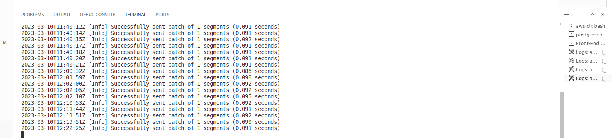
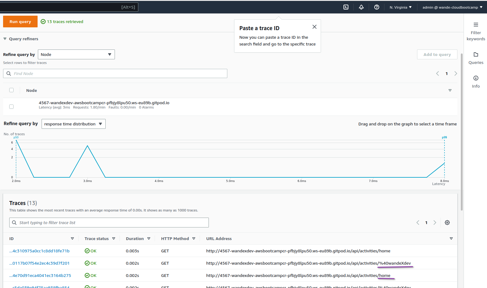
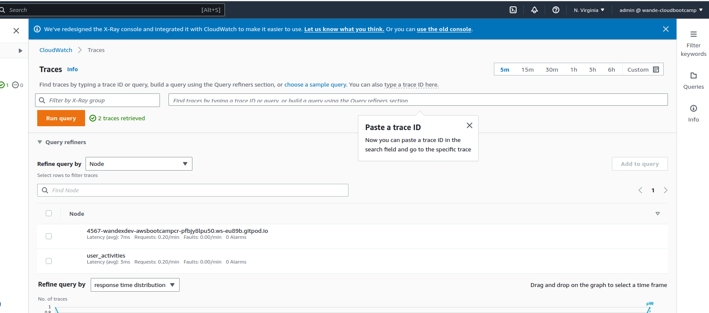
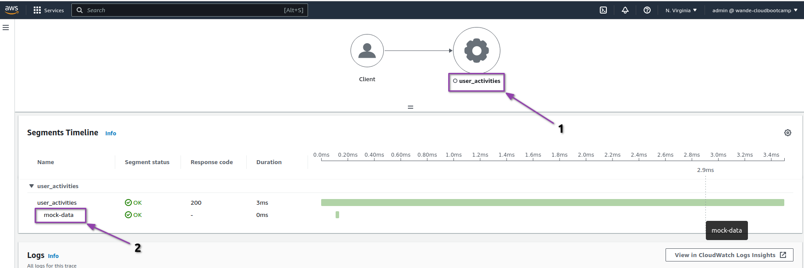
### 2. 


## References:
- [Open telemetry for python-Honeycomb.io Documentation](https://docs.honeycomb.io/getting-data-in/opentelemetry/python/)
- [honeycomb-whoami.glitch.me](honeycomb-whoami.glitch.me)
- [SDK documention(python-boto3)](https://aws.amazon.com/sdk-for-python/)
- [aws SDK xray python on github](https://github.com/aws/aws-xray-sdk-python)
- [Boto3 documentation](https://boto3.amazonaws.com/v1/documentation/api/latest/reference/services/xray.html)
- [Rollbar Documentation on Github](https://github.com/rollbar/pyrollbar)
- [watchtoer-PyPi](https://pypi.org/project/watchtower/)
- 