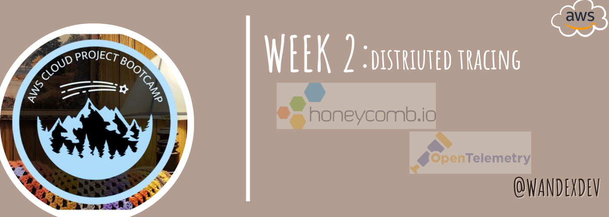

# Week 2 — Distributed Tracing

## Synopsis:
Week 2 emphasized **observability** and I learnt about its 4 pillars (metrics, logs, events and traces) as well as how crucial it is in the entire software development cycle. 

## [Required Homework](#required)
### 1. Instrument backend flask app to Open Telemetry (OTEL) using Honeycomb.io
### 2. Run Queries to explore traces within Honeycomb.io
### 3. Instrument AWS X-Ray into backend flask app
### 4. Configure, provision X-Ray daemon within docker-compose 
### 5. Observe X-Ray in AWS console
### 6. Integrate Rollbar and capture error
### 7. Configure custom logger to send CloudWatch Logs

## [Homework Challenges](#challenges)

## References:
- [Open telemetry for python-Honeycomb.io Documentation](https://docs.honeycomb.io/getting-data-in/opentelemetry/python/)
- [honeycomb-whoami.glitch.me](honeycomb-whoami.glitch.me)
